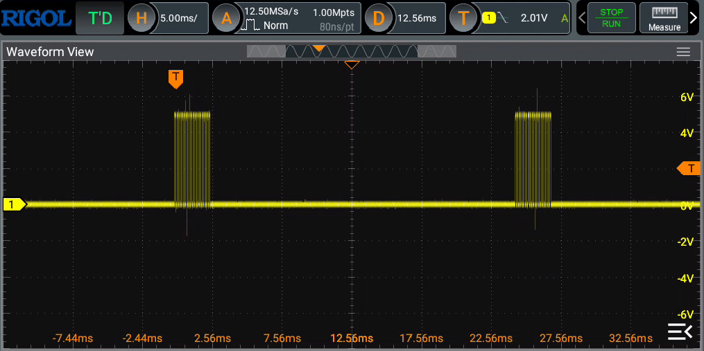

## ScopeTester | Demo board for oscilloscope testing

This is a hardware project based on Atmega8A microcontroller. This project came about from a
personal need for a demo board to test my new oscilloscope. I plan to create a complete PCB
along with firmware in this repo.

### Goals

- [X] Firmware: RS232 sample output (positive)
- [ ] Firmware: RS232 sample output (negative)
- [X] Firmware: Holdoff test
- [ ] Firmware: I2C sample output
- [X] Firmware: Runt pulse (+ve & -ve runt pulses)
- [ ] Firmware: Sine wave pattern
- [ ] Firmware: Burst data in two lines
- [X] Firmware: Separate arch independent codes
- [X] Unittests: Add unittests for utils
- [X] Unittests: Add unittests for existing tests

### Test screenshots

##### 1. Serial RS232 (TTL Level) decoding test


##### 2. Positve Runt pulse


##### 3. Negative Runt pulse


##### 4. Holdoff demo

* Unstable trigger


* After proper holdoff adjustment - Stable trigger


## Building prerequisites

1. Requires Linux environment for building.
2. GNU Make
3. avr-gcc
4. avr-libc

### Firmware

```
BUILD_DIR=out make
```

Firmware is the `./out/firmware.hex` file. To program micro with avrdude, we can do `make program`.

### Unittests

We can build every unittests and run them using the `run` target.

```
BUILD=ut BUILD_DIR=out/ut make run
```

# Feedback

Open a GitHub issue or drop a email at arjobmukherjee@gmail.com. I would love to hear your
suggestions and feedbacks.
