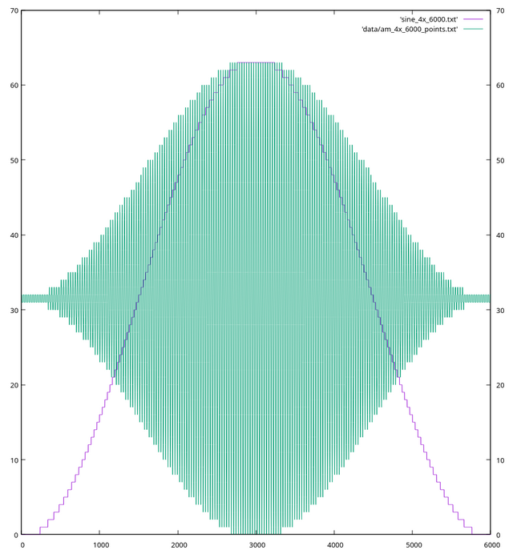
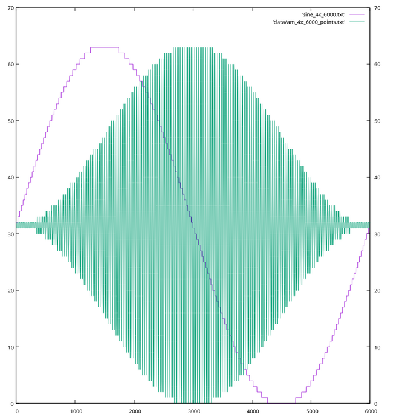

##### 14-August-2025 19:44:42
# Generation of waves using DAC
##### Tags: electronics

The microcontoller is indexing into an array of values and writes them to DAC. The timing between
each writes is not controlled but can be taken as constant. Say the aray contains values that
represent one cycle of a sine wave. When these are written out, the frequency of the resulting
waveform will depend on two things:
1. `T` - The time spent by the microcontoller between writing two consecutive values to the DAC.
2. `N` - Number of values that represent the one cycle. If there are more number of points/values
   then it will take more time to dump the whole array to the DAC. Thus (frequency of the
   wave) `f ~ 1/(T * N)`.

The above relation of `f` & `N` means that a fast waveform requires less number of points but
also for the same reason will look bad because of the large quantization steps. This will be played
with depending on what waveform is generated.

All this happens in the microcontoller side and as you can see it just dumps data into the DAC and
does not control either the frequency or the look of it. Both depends on the how the values are
generated.

### Generation of DAC data - Sine wave

As stated above the DAC values given to the microcontoller represent one cycle of the required
waveform (one cycle all that is required because the waveform is repeating). If we want to increase
frequency, less points will represent that cycle, and a nicer looking waveform (but lower frequency)
will have more points for the same cycle.

Take the example of sine wave generation:

#### Algorithm

`sine(freq_scale, sample_count)` where 

* `freq_scale` - Number of generated points (samples) will be decreased to increase frequency by
  this amount
* `sample_count` - This many points will make one cycle of the repeating waveform, when `freq_scale`
  is 1.


```c
sine(freq_scale, sample_count) {
    // Time is incremented by this amount in each iteration.
    dt = freq_scale / sample_count
    
    // Since we stop iterating when time of 1.0 is reached, the number of samples that will be
    // in the output by then is 1/dt or `sample_count/freq_scale` number of points. That is as
    // `freq_scale` increases, N decreases and vice-versa.
    // Also note we have reached full cylcle (2 * PI radians) when time reached 1.0.
    N = 1/dt
    
    // Output list
    List(f64) output = empty;
    for (t = 0; t < 1.0; t += dt) {
        output.add(sin(2 * PI * t))
    }
    
    return output
}
```

#### Explanation

After `N = 1/dt` iterations, we will have `t = N * dt => t = dt/dt = 1`. In other words after `N`
iterations we have
* Number of cycles: 1
* Number of radians traversed: `2 * PI`.
* Number of sample points: `sample_count/freq_scale`.

So in the end, if `freq_scale` is 1, output represents one cycle and will have `sample_count` number
of points. If `freq_scale` is 2, output still will represent one cycle but now will have
`sample_count/2` number of points. Less number of points to equates to faster dump thus more
frequency.

##### Why not use `sin(2 * PI * freq_scale * t)` instead?

Lets do the same calculation as above. Since `freq_scale` now moved to the sine function, `dt`
becomes `dt = 1.0 / sample_count`. After `N = 1/dt` iterations, we will have `t = N * dt => t =
dt/dt = 1`. This remains the same, but the outcome is different. So  after `N` iterations we have
* Number of cycles: `freq_scale`. If it is 1, then 1 cycle, if its 2 then 2 cycles and so on.
* Number of radians traversed: `2 * PI * freq_scale`.
* Number of sample points: `sample_count`

So in the end, if `freq_scale` is 1, like before output represents one cycle and will have
`sample_count` number of points. If however `freq_scale` is 2, output will instead represent 2
cycles but will still have `sample_count` number of points. Same number of points representing more
number of cycles means less number of points per cycle and thus like before this equates to faster
dump thus more frequency.

So now that we know the difference between the two ways, the former method is chosen for generating
sine wave, since it always output one single cycle, which is what we want.

### Generation of DAC data - AM wave

Much of the things remain the same, however there are a few more parameters which we need to know
about. Lets recap the parameters which are common and the new ones

1. Number of sample points: `sample_count`
2. Number of cycles per envelop eye: $n = BASE\_FREQ * freq\_scale$. Where `BASE_FREQ` is any constant,
   currently its `50`.
3. Number of sample points per cycle: $S = sample\_count/n$. This many samples make up each cycle of
   the carrier wave. Larger `S` makes a smoother wave which less prominent steps. This however
   cannot be larger than $2^{DAC\_BITS} - 1$. We use 6 bit DAC so `DAC_BITS` is 6 in our case.

In order to control both the carrier frequency and the signal frequency a relation need to be made
between them and the number of sample points.

We know that the total number of samples (`sample_count`) determines the signal frequency, so it can
be said

* $sample\_count \propto t_m$ where $t_m$ is the time period of the signal wave.
* $sample\_count \propto n * t_c$ where $n$ is as defined above and t_c$ is the time period of the
  carrier wave.
* Thus $t_m = n * t_c$ <br/>
  or ${t_m/t_c} = n$ <br/>
  or ${f_c/f_m} = n$ where $f_c$ & $f_m$ are carrier frequency & singal frequency respectively.

This above relation makes it possible to change one frequency by keeping the other fixed and varying
$n$. For example in order to increase the signal frequency for some carrier frequency, we have to
decreases $n$.

From a general understanding the following relation between the frequencies and sample count can be
established.

* $f_c \propto 1/S$. Less number of points in one cycle of the carrier wave, more it the resulting
  frequency of the wave.
* $f_m \propto 1/sample\_count$. Less is the total number of points, more is the overall frequency
  and thus the envelop/signal frequency.

Now that the theory is done, lets look at the algorithm

#### Algorithm

`am(freq_scale, sample_count)` where 

* `freq_scale` - Used to calculate the number of complete cycles in one envelop eye ($n$ as above).
* `sample_count` - Total number of points in one envelop eye. Unlike the sine wave case here we will
  always produce this many samples irrespective of the `freq_scale` value.

```c
am(freq_scale, sample_count) {
    // Time is incremented by this amount in each iteration.
    // This implies that `sample_count` number of points will be in output when time of 1.0 is
    // reached (where we stop).
    dt = 1.0 / sample_count
    
    // BASE_FREQ is a constant. When freq_scale is 1, n = BASE_FREQ. That is when freq_scale = 1,
    // `BASE_FREQ` number of complete cycles (of carrier wave) will be outputted.
    BASE_FREQ = 50
    n = BASE_FREQ * freq_scale
    
    // Output list
    List(f64) output = empty;
    for (t = 0; t < 1.0; t += dt) {
        // * The 0.5 multiplication is to keep the result of the following equation between 0 and 1.
        //   Without it the output is between 0 and 2. See below
        // * Phase shift of (PI / 2) is applied just to reposition the generated wave. See below.
        output.add((1 + sin(2 * PI * t - (PI / 2)) * 0.5 * cos(2 * PI * t * n)
    }
    
    return output
}
```

The below image shows the modulated wave and the carrier wave.



* Note that one modulated eye is one full cycle of the signal not half cycle. Below image make it
  more clear.

For as an FYI the below image shows the same but without the phase shift of $\pi/2$ applied.


#### Expectations

After `N = 1/dt` iterations, we will have `t = N * dt => t = dt/dt = 1`. In other words after `N`
iterations we have
* Number of cycles (signal wave): `1`
* Number of cycles (carrier wave) (`n`): `freq_scale * BASE_FREQ`
* Number of sample points: `sample_count`
* Number of samples per carrier wave cycle (`S`): $sample\_count/n$.

Note that this is exactly what other (alternate) method described in the Sine wave generation
section.

#### How to increase $f_m$ while keeping the $f_c$ and $S$ same?

Lets assume the following is AM wave we have currently:
```
* n             = 200. i.e freq_scale = 4 for BASE_FREQ = 50.
* fc / fm       = 200
* sample_count  = 6000
* S             = sample_count / n = 30

Actual frequency seen:
* fc = 41E3 Hz
* fm = 204  Hz
```

Now lets see what it takes to make systematic changes such as to increase the signal frequency while
keeping the look and feel same (carrier frequency and number of points per carrier wave cycle).

Its mentioned above that $f_m \propto 1/sample\_count$. Therefore to increase $f_m$, we have to
decrease $sample\_count$. However since $S = sample\_count/n$, in order to keep $S$ constant we have
to also decrease $n$.

Lets start by decreasing `n` first. Recall that `n` is the number of carrier cycles per envelop eye.
This will result in a higher `S`, so requires `sample_count` to also be lowered in order to keep `S`
constant.  Here `n` is decreased from 200 to 75. This is what is shown below.

```
* n            = 75 (our choice)
* S            = 30  (same as before)
* sample_count = S * n
               = 30 * 75 = 2250
* fc / fm      = 75 (from equation)
```

To generate the above/required AM wave we have call `am` function with the following parameters.
* `sample_count` = 2250
* `freq_scale`   = ${n \over BASE\_FREQ}$ = ${75 \over 50} = 1.5$.

```
Actual frequency seen

* fc = 41E3 Hz
* fm = 540  Hz
```

-------------------------
